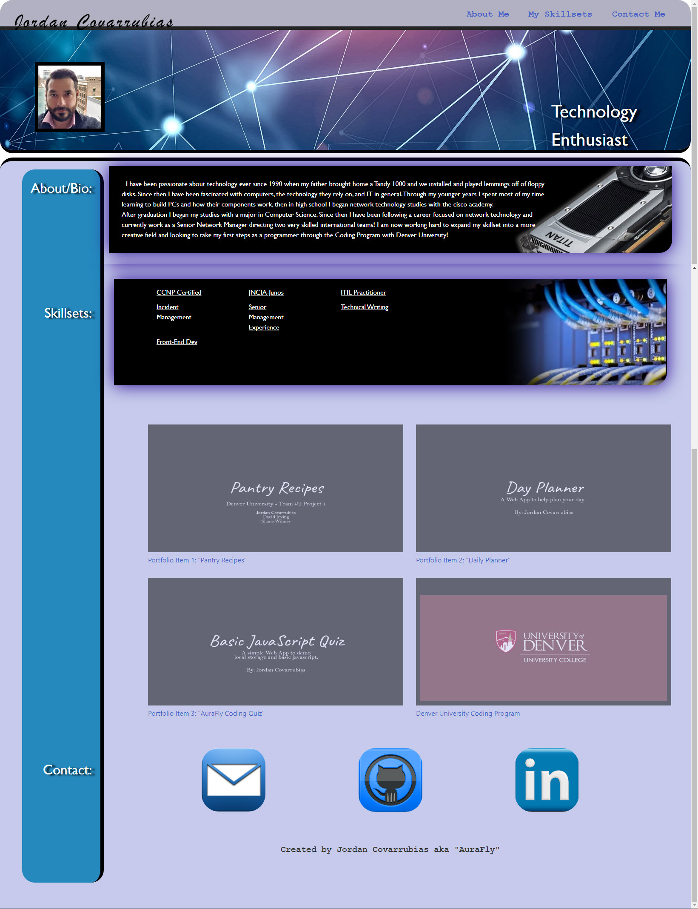

# Portfolio (Revised from Homework 02)
## Homework for last week of CSS or week 2 overall - this requires us to create a portfolio using html/css that we covered over the last two weeks of class.

- The motivation for myself is to demonstrate what I have learned over the last two weeks and demonstrate that I have built on my ability to use CSS and HTML toolsets.
- I have utilized several different CSS styles that were not covered in our class and have attempted to use them in my portfolio.
- During this task I learned how quickly your code can become quite bloated and tried to keep things to a min. I know that there is probably a lot more fat I can trim.

## Website can be viewed here:
- https://aurafly.github.io/Homework02/

## Usage
- Looking at the site listed above, all nav links at the top right of the page should function and bring you to the appropriate place on the page.
- Highlighting different skillsets will display a tooltip with a brief definition.
- Hovering over different assets will show where your cursor is hovering by highlighting the segment.
- Clicking on the display images for each image for skillsets will bring you to a page that further discusses what those specific skillsets are.
- Clicking on images in the contactme section should open a prompt to email my email address, the github block will bring you to my current github page, and linkedin will take you to my linked in profile.
- Site should somewhat scale to different resolutions and views, there are several errors that I am aware of with this that I am working through.

## Credits:
Jordan Covarrubias aka "Aurafly"
