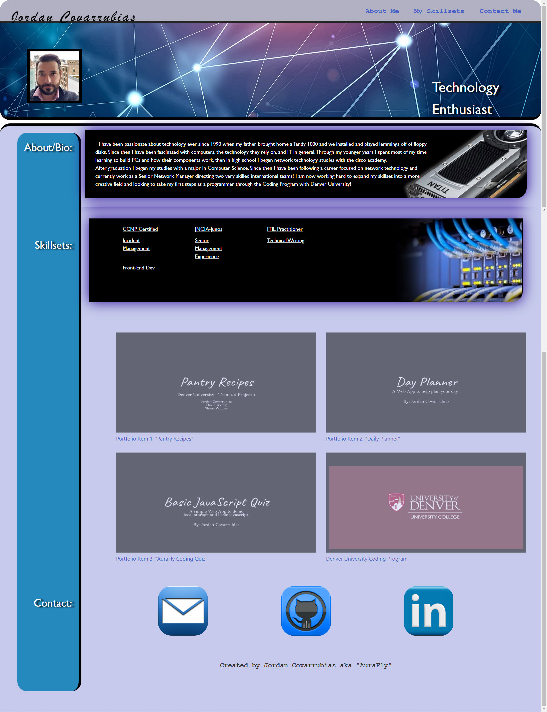

# Portfolio
## About me:

My name is Jordan Covarrubias, but I go by the alias AuraFly on different online communities and projects. I have been passionate about technology ever since 1990 when my father brought home a Tandy 1000 and we installed and played lemmings off of floppy disks. Since then I have been fascinated with computers, the technology they rely on, and IT in general.

Through my younger years I spent most of my time learning to build PCs and how their components work, then in high school I began network technology studies with the cisco academy. After graduation I began my studies with a major in Computer Science. Since then I have been following a career focused on network technology and currently work as a Senior Network Manager for FIS. I am now working hard to expand my skillset into the programming/dev world to hopefully open additional doors and prepare myself for a software/automation driven industry.

## Website can be viewed here:
- https://aurafly.github.io/Portfolio/

## Usage
- Looking at the site listed above, all nav links at the top right of the page should function and bring you to the appropriate place on the page.
- Highlighting different skillsets will display a tooltip with a brief definition.
- Hovering over different assets will show where your cursor is hovering by highlighting the segment.
- Clicking on the display images for each image for skillsets will bring you to a page that further discusses what those specific skillsets are.
- Clicking on images in the contactme section should open a prompt to email my email address, the github block will bring you to my current github page, and linkedin will take you to my linked in profile.
- Site should somewhat scale to different resolutions and views, there are several errors that I am aware of with this that I am working through.

## Credits:
Jordan Covarrubias aka "Aurafly"
